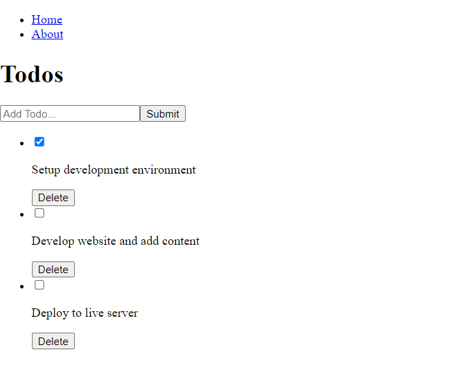

# React Todo App
## Description
This is Todo app that let you add new todos, edit, remove them.
this app built with react library and
## Site Screenshots

## Built With

- React.
- HTML.
- CSS.
- Webpack.
- JavaScript.
- Linters.

## Install

- Install node.js from [HERE](https://nodejs.org/en/).
  
## Deployment

1. Clone the project using git-bash or Githup Desktop.
2. Open the project folder with VSCode or any Editor.
3. Open terminal and navigate to the project folder.
4. Type `npm install`.
5. Type `npm start`.

## Authors

👨‍💻 **Omar Muhammad**

- GitHub: [@Omar-Muhamad](https://github.com/Omar-Muhamad)
- Twitter: [@Eng_OmarMuhamad](https://twitter.com/Eng_OmarMuhamad)
- LinkedIn: [@eng-omarmuhammad](https://www.linkedin.com/in/eng-omarmuhammad/)

## Show your support

Give a ⭐️ if you like this project!
## 📝 License

This project is [MIT](./MIT.md) licensed.
